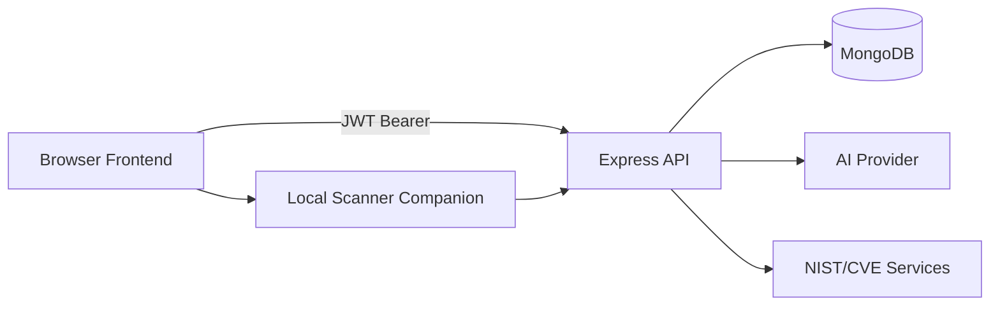
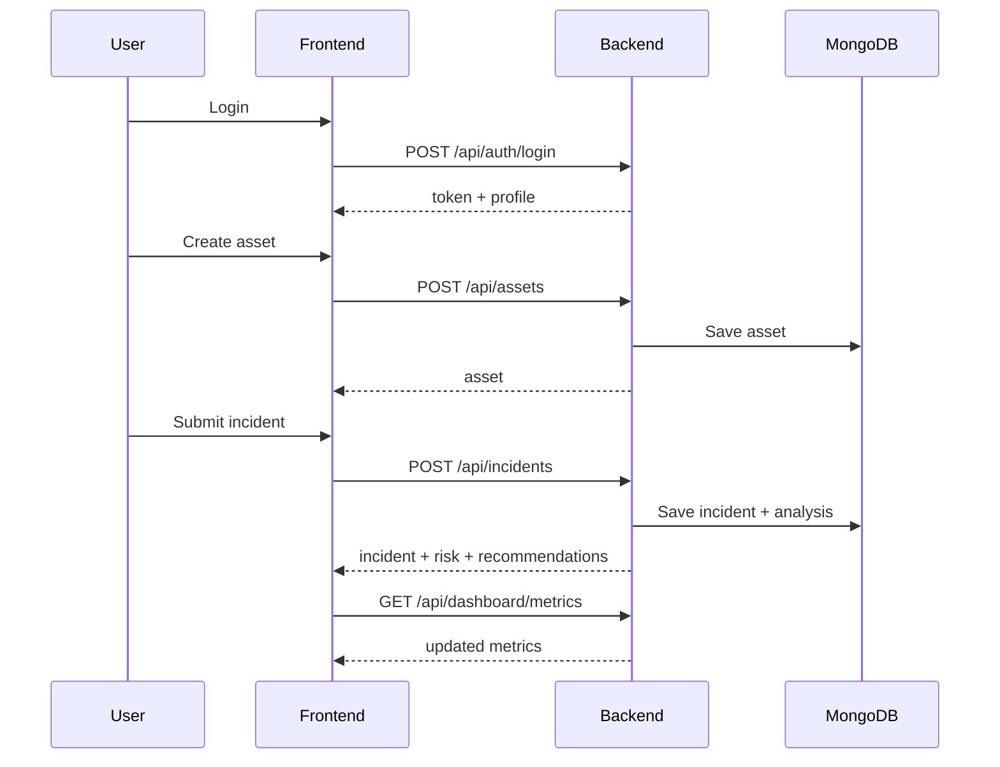

# Hotel Cybersecurity Governance System
# Technical Documentation

Version: 2026-04-16
Audience: Developers, maintainers, QA, operators, technical leadership
Status: Comprehensive consolidated reference (updated for latest backend/frontend/security changes)

---

## Table of Contents

1. Document Overview
2. Section Source: README.md
3. Section Source: docs/README.md
4. Section Source: docs/overview/system-overview.md
5. Section Source: docs/tutorials/local-development.md
6. Section Source: docs/tutorials/report-first-incident.md
7. Section Source: docs/guides/architecture-and-request-flow.md
8. Section Source: docs/guides/security-and-operations-gotchas.md
9. Section Source: docs/manuals/api-reference.md
10. Section Source: docs/manuals/data-model-reference.md
11. Recent Implementation Updates (New)
12. Code Snippets Appendix (Expanded)
13. Validation and Test Notes
14. Glossary and Operational Notes

---

## 1. Document Overview

This file is the full professional technical document for the Hotel Cybersecurity Governance System. It consolidates and updates core project docs into one narrative while preserving source-based sectioning.

It is updated to reflect current implementation state, including:
- Password reset with security questions and optional 2FA/recovery-code path.
- Risk forecast removal from backend and frontend.
- Backend security hardening around CORS, startup seeding policy, and regex-safe asset search.
- Frontend hardening around token storage, session handling, and dynamic HTML sanitization.
- Local scanner setup flow/documentation improvements.

---

## 2. Section Source: README.md

### Hotel Cybersecurity Governance System

### Executive Summary

The Hotel Cybersecurity Governance System is a web-based platform that helps hotel teams operationalize cybersecurity without requiring specialist-only workflows. It combines structured incident handling, asset-centered context, threat analysis, and governance-aligned outputs.

### What This Website Is

A cybersecurity operations and governance portal for hotels that provides:
- Central incident reporting/tracking.
- Asset-oriented exposure visibility.
- Risk scoring and prioritization.
- Governance-aligned recommendations.

### What This Website Is For

Primary goals:
1. Register digital assets.
2. Capture incidents in plain language.
3. Analyze incidents using AI + contextual signals.
4. Quantify risk for prioritization.
5. Map outcomes to governance controls.
6. Monitor trends via dashboard views.

### Target Users

Operational Staff:
- Quick incident reporting with guided forms.

Security/IT Managers:
- Incident triage, trend analysis, remediation planning.

Management:
- High-level risk visibility and decision support.

### Core Functional Areas

1. Authentication and Access.
2. Asset Management.
3. Incident Reporting and Tracking.
4. AI-Assisted Threat and Risk Analysis.
5. Dashboard and Governance Visibility.
6. Audit and export visibility workflows.

### Business Value

- Reduced ambiguity in response flow.
- More consistent prioritization via normalized risk scores.
- Better governance readiness through mapped recommendations.
- Operational and leadership visibility in one system.

### System Architecture (High Level)

- Frontend: Static HTML/CSS/JavaScript pages.
- Backend API: Express on Node.js.
- Database: MongoDB via Mongoose.
- Security controls: JWT auth, hashing, CORS allowlist, secure headers, rate limits.

### Current Deployment Model

- Frontend: GitHub Pages.
- Backend: Render-hosted Node service.
- Local scanner: companion executable/service for local network scan workflows.

### Localhost Testing (Frontend + Backend)

Backend:
```bash
cd backend
npm install
npm run dev
```

Frontend (static):
```bash
cd frontend
npx serve -l tcp://127.0.0.1:3000 .
```

### API Routing Behavior

- localhost/127.0.0.1 frontend -> local backend URL.
- hosted frontend -> production API URL.
- optional override via `localStorage.apiBaseUrlOverride`.

### CORS Configuration (Production)

Set `CORS_ORIGIN` with explicit trusted origins. Current backend normalizes origin values and checks against an effective allowlist.

### Test Accounts / Seeding

Seed behavior is now guarded by environment policy:
- automatic seeding in `development`/`test`.
- disabled by default in production.
- can be explicitly enabled with `SEED_ON_STARTUP=true`.

### Future Improvement Opportunities

- Deeper permission enforcement coverage.
- Additional operational audit dimensions.
- Optional alerting/notification workflows.
- Expanded structured error-code catalogs.

---

## 3. Section Source: docs/README.md

### Technical Documentation Hub

The documentation map follows role-oriented reading paths:
- Overview for context.
- Tutorials for execution.
- Guides for architectural reasoning and gotchas.
- Manuals for endpoint/model reference.

### Documentation Map

Overview:
- `docs/overview/system-overview.md`

Tutorials:
- `docs/tutorials/local-development.md`
- `docs/tutorials/report-first-incident.md`

Guides:
- `docs/guides/architecture-and-request-flow.md`
- `docs/guides/security-and-operations-gotchas.md`

Manuals:
- `docs/manuals/api-reference.md`
- `docs/manuals/data-model-reference.md`
- `docs/manuals/Hotel-Cybersecurity-Technical-Documentation-Professional.md`

---

## 4. Section Source: docs/overview/system-overview.md

### Purpose

Provide practical cybersecurity governance workflows for hotels with clear, operational outputs.

### Product Scope (Current)

In scope:
- Auth/profile with 2FA options.
- Asset lifecycle (soft delete).
- Incident lifecycle (analysis + updates + notes + soft delete).
- Threat/risk/NIST support flows.
- Dashboard metrics/charts.
- Audit log retrieval and exports.

Out of scope (current):
- Full organization-level multi-tenant hierarchy beyond user ownership.
- Full enterprise-grade RBAC matrix enforcement on every route.

### High-Level Architecture



### Request Lifecycle

1. Security middleware (helmet/rate-limit/CORS/body parsing).
2. Optional JWT + permission middleware.
3. Route validation.
4. Controller orchestration.
5. Service-layer processing/enrichment.
6. Model persistence/query.
7. Normalized response or global error handling.

### Security Model Summary

- JWT-protected non-auth routes.
- Rate limiting for API/auth/enrichment paths.
- CORS allowlist enforcement.
- Input validation at route and service boundaries.
- Soft delete semantics for key entities.

---

## 5. Section Source: docs/tutorials/local-development.md

### Goal

Run backend and frontend locally and verify auth + API connectivity + incident path.

### Prerequisites

- Node.js 18+
- MongoDB URI
- Optional AI key for full AI-backed analysis behavior

### Quick Setup

```bash
npm --prefix backend install
npm --prefix backend run dev
npx serve -l tcp://127.0.0.1:3000 frontend
```

### Environment Variables (Representative)

```env
PORT=5000
NODE_ENV=development
MONGODB_URI=...
JWT_SECRET=...
JWT_EXPIRATION=24h
JWT_REFRESH_SECRET=...
JWT_REFRESH_EXPIRATION=7d
CORS_ORIGIN=http://localhost:3000,http://127.0.0.1:3000
GEMINI_API_KEY=...
GEMINI_MODEL=gemini-1.5-flash
GEMINI_MODEL_VERSION=v1beta
SEED_ON_STARTUP=true
```

### Common Issues

- 401 loops: clear stale session token and re-login.
- CORS failures: confirm exact origin string and restart backend.
- AI failures: verify key/model/version and outbound network.
- Local scanner access restrictions: ensure secure context/localhost and scanner health endpoint availability.

---

## 6. Section Source: docs/tutorials/report-first-incident.md

### End-to-End Workflow



### Validation Outcomes

Expected outputs include:
- Incident ID and status.
- Threat and risk fields.
- NIST-aligned controls/functions.
- Recommendations and dashboard updates.

---

## 7. Section Source: docs/guides/architecture-and-request-flow.md

### Layered Backend Design

Route -> Controller -> Service -> Model, with middleware handling cross-cutting concerns.

### Frontend Composition

- Page-specific modules.
- Shared API client for transport/session.
- Shared utility module for common UI concerns.

### Authentication Flow Notes (Current)

- Access tokens are now session-scoped in frontend storage.
- Backward-compatible migration from legacy localStorage token key is implemented.
- Auth-free endpoint gating exists in API client request layer.

### Incident Analysis Flow

- Asset ownership and scope checks.
- Threat classification service (AI + threat intel blending).
- Risk calculation.
- NIST mapping.
- Recommendation generation.
- Persistence of final incident snapshot.

### Error Handling Strategy

- Route-level validation for contract shape.
- Controller-level expected failure handling.
- Global error handler for normalized unexpected failures.

### Rate Limiting Strategy

- Global API limit.
- Auth endpoint limits.
- Enrichment-focused limiter.

### Extensibility Points

- AI provider adapter points.
- Additional threat intel integrations.
- Permission policy expansion.

---

## 8. Section Source: docs/guides/security-and-operations-gotchas.md

### Authentication and Session Gotchas

- Session validity has inactivity + absolute local timers in frontend.
- Backend JWT validity remains final authorization authority.
- 401 on authenticated requests triggers local session expiry behavior.

### Authorization Gotchas

- Ownership scoping is widely used.
- Permission checks exist on selected routes; full matrix expansion remains a future enhancement area.

### CORS Gotchas

- Origin normalization is strict.
- Allowlist policy should be explicit in production.
- Non-origin requests are intentionally allowed for non-browser/system usage.

### Data Lifecycle Gotchas

- Soft deletes can cause DB-level counts to differ from API-visible records.

### Performance/Scaling Notes

- Query-heavy chart endpoints should be monitored as data grows.
- Search and aggregation strategies may need indexing/pipeline tuning.

### Production Hardening Checklist (Current)

1. Strong JWT and bridge secrets.
2. Tight CORS allowlist.
3. Production-safe seeding defaults (already improved).
4. Monitor 401/rate-limit/AI failure patterns.
5. DB backup/retention controls.

---

## 9. Section Source: docs/manuals/api-reference.md

### Conventions

- Base local URL: `http://localhost:5000/api`
- JSON payloads
- Bearer JWT on protected endpoints

### Authentication Endpoints (Current)

- `POST /auth/register`
- `POST /auth/login`
- `POST /auth/refresh`
- `POST /auth/forgot-password`
- `POST /auth/reset-password`
- `POST /auth/2fa/verify-login`
- `POST /auth/2fa/setup`
- `POST /auth/2fa/enable`
- `POST /auth/2fa/disable`
- `GET /auth/profile`
- `PUT /auth/profile`
- `GET /auth/security-questions`
- `PUT /auth/security-questions`
- `POST /auth/change-password`

### Assets, Incidents, Threat, Risk, NIST, Dashboard, Audit

All corresponding route groups are present and auth-protected (except selected scanner bridge flow where tokenized bridge submission applies).

### HTTP Status Patterns

- 200/201 success
- 400 validation
- 401 auth failure
- 403 forbidden/inactive/denied paths
- 404 not found
- 409 conflict in select one-time-token paths
- 429 rate limit
- 500 server errors

---

## 10. Section Source: docs/manuals/data-model-reference.md

### Core Entities

- User
- Asset
- Incident
- RiskAssessment
- Threat
- AuditLog
- ScanHistory

### Notable Model Behaviors

- Soft-delete semantics in asset and incident workflows.
- Ownership scoping by `userId`.
- Security-question and 2FA state handling in user flows.

### Environment Variables (Current Practical Set)

Baseline:
- `MONGODB_URI`
- `JWT_SECRET`

Recommended:
- `JWT_EXPIRATION`
- `JWT_REFRESH_SECRET`
- `JWT_REFRESH_EXPIRATION`
- `CORS_ORIGIN`
- `SEED_ON_STARTUP`

AI/analysis path:
- `GEMINI_API_KEY`
- `GEMINI_MODEL`
- `GEMINI_MODEL_VERSION`

---

## 11. Recent Implementation Updates (New)

### 11.1 Security Hardening

Backend:
- CORS pattern tightened.
- Startup seeding gated by environment/flag.
- Regex-safe asset search handling.
- Strong registration password policy enforcement.

Frontend:
- access token moved to session storage with migration fallback.
- dynamic HTML sinks sanitized in critical render paths.
- safer dynamic class-token handling.

### 11.2 Feature Lifecycle Changes

- Risk forecast capability removed from backend/frontend.
- password recovery expanded (security questions + optional 2FA path).

### 11.3 Documentation and Explainability

- backend and frontend complex modules enriched with WHY-focused comments.
- documentation hub linked to this professional consolidated manual.

---

## 12. Code Snippets Appendix (Expanded)

### 12.1 Backend: Controlled CORS + Seeding Policy

```js
const corsOptions = {
  origin: (origin, callback) => {
    if (!origin) return callback(null, true);
    const requestOrigin = normalizeOrigin(origin);
    const isAllowed = effectiveAllowedOrigins.includes(requestOrigin);
    return isAllowed ? callback(null, true) : callback(new Error(`Not allowed by CORS: ${requestOrigin}`));
  }
};

function shouldSeedDatabase() {
  const env = String(process.env.NODE_ENV || '').toLowerCase();
  const seedFlag = String(process.env.SEED_ON_STARTUP || '').toLowerCase();
  if (seedFlag === 'true') return true;
  return env === 'development' || env === 'test';
}
```

### 12.2 Backend: Regex-Safe Asset Search

```js
function escapeRegex(input = '') {
  return String(input).replace(/[.*+?^${}()|[\]\\]/g, '\\$&');
}

const query = String(req.query.query || '').trim().slice(0, 80);
const escapedQuery = escapeRegex(query);
```

### 12.3 Backend: Strong Password Rule

```js
const STRONG_PASSWORD_PATTERN = /^(?=.*[a-z])(?=.*[A-Z])(?=.*\d)(?=.*[^A-Za-z0-9])\S{12,}$/;
```

### 12.4 Frontend: Token Migration + Session-Scoped Storage

```js
this.token = sessionStorage.getItem(ACCESS_TOKEN_STORAGE_KEY)
  || localStorage.getItem(ACCESS_TOKEN_STORAGE_KEY);

if (this.token && localStorage.getItem(ACCESS_TOKEN_STORAGE_KEY)) {
  localStorage.removeItem(ACCESS_TOKEN_STORAGE_KEY);
  sessionStorage.setItem(ACCESS_TOKEN_STORAGE_KEY, this.token);
}
```

### 12.5 Frontend: Sanitized Dynamic Rendering

```js
function escapeHtml(value) {
  return String(value ?? '')
    .replace(/&/g, '&amp;')
    .replace(/</g, '&lt;')
    .replace(/>/g, '&gt;')
    .replace(/"/g, '&quot;')
    .replace(/'/g, '&#39;');
}

const safeAssetName = escapeHtml(asset.assetName);
row.innerHTML = `<td data-label="Asset Name">${safeAssetName}</td>`;
```

### 12.6 Threat Classification Guardrail

```js
if (signal.isCriticalRansomware) {
  return {
    ...classification,
    threatType: 'Ransomware',
    confidence: Math.max(classification.confidence || 0, 85),
    likelihood: Math.max(classification.likelihood || 1, 4),
    impact: Math.max(classification.impact || 1, 4),
  };
}
```

---

## 13. Validation and Test Notes

Recently exercised validation patterns:
- Syntax checks (`node --check`) on all modified backend/frontend files.
- Targeted backend test suites for changed modules:
  - nmap scan service
  - auth controller
- Manual front-end checks for scanner, auth reset paths, and rendering behavior.

---

## 14. Glossary and Operational Notes

Asset Security Context:
- Runtime-enriched view combining asset profile, scan telemetry, CVE query state, and recommendations.

Bridge Token:
- Short-lived, one-time scanner token to ingest local scanner output safely.

Deterministic Risk Scoring:
- Optional mode where CVE severity drives risk normalization consistency.

Soft Delete:
- Data marked deleted and filtered out by default queries instead of being physically removed.

---

## 15. Whole Codebase Reference

This section expands the document from a narrative manual into a true codebase map. It is intended to answer the question, "what does every major file do, and how does it fit into the system?"

### 15.1 Repository Layout

Root-level project areas:
- backend: Express API, controllers, services, models, middleware, scripts, tests.
- frontend: static HTML pages, shared CSS, shared JavaScript modules.
- docs: technical guides, tutorials, manuals, and this consolidated reference.
- memories: session and repository notes used by the coding workflow.

### 15.2 Backend Package Map

The backend is organized around a standard request pipeline:
- server.js bootstraps the application, registers middleware, mounts routes, and starts the server.
- config/database.js owns MongoDB connection lifecycle.
- config/ai-config.js centralizes AI model/provider configuration.
- middleware/auth.js validates JWTs and attaches the current user context.
- middleware/rateLimiter.js defines API throttling rules.
- middleware/validateRequest.js converts validation results into consistent 400 responses.
- middleware/errorHandler.js normalizes unexpected failures.
- routes/*.js defines endpoint groups and route-level validation.
- controllers/*.js contains request orchestration and response shaping.
- services/*.js contains business logic, enrichment, scoring, and integrations.
- models/*.js defines persistence schemas and model behavior.
- scripts/*.js handles seed/reset workflows for local and test environments.
- utils/*.js provides constants, logger setup, and shared validation helpers.

### 15.3 Frontend Package Map

The frontend is a static multi-page app with shared modules:
- index.html is the landing page and entry navigation.
- login.html handles authentication entry.
- dashboard.html presents operational metrics and summaries.
- assets.html handles asset inventory and security context views.
- report-incident.html submits incident reports.
- incident-logs.html lists and manages incident history.
- risk-analysis.html exposes incident risk assessment views.
- audit-logs.html presents audit trail data.
- settings.html exposes user preferences and security settings.
- faq.html, user-guide.html, and contact-support.html provide self-service guidance.
- css/*.css contains layout, form, dashboard, responsive, and help-page styling.
- js/api-client.js centralizes API transport, auth headers, and session handling.
- js/auth.js drives login, registration, password reset, and 2FA flows.
- js/assets.js drives asset CRUD and scanner-enriched asset context.
- js/dashboard.js drives dashboard metrics and charts.
- js/incident-report.js manages incident submission and analysis rendering.
- js/incident-logs.js manages list/filter/update workflows for incidents.
- js/risk-analysis.js handles risk detail presentation and prioritization views.
- js/audit-logs.js renders audit log data and export options.
- js/settings.js manages profile/security settings.
- js/help-pages.js powers support and guidance content.
- js/utils.js provides formatting, validation, skeletons, and UI helpers.

### 15.4 Backend Controllers in Detail

Auth controller responsibilities:
- register, login, refresh, forgot-password, reset-password.
- profile retrieval and profile updates.
- password change and security question management.
- 2FA setup, enable/disable, and login verification.
- recovery-code generation and reuse protection.

Asset controller responsibilities:
- create, list, update, and soft-delete assets.
- fetch asset security context.
- merge scan enrichment, CVE context, and recommendations.

Incident controller responsibilities:
- create incidents.
- fetch incident lists and detail records.
- update status and notes.
- calculate threat/risk output and persist the analysis result.

Dashboard controller responsibilities:
- aggregate user-visible metrics.
- return trend and summary data for charts and cards.

NIST controller responsibilities:
- expose NIST/CVE-related enrichment and mapping data.
- keep external threat-intel lookups behind auth.

Local scanner controller responsibilities:
- validate and ingest results from the local scanner bridge.
- persist scan history and return normalized scanner payloads.

Threat controller responsibilities:
- surface threat classification data.
- feed downstream risk and recommendation views.

Risk controller responsibilities:
- return risk scores, breakdowns, and prioritization helpers.

Audit log controller responsibilities:
- return audit records.
- support review and export use cases.

### 15.5 Backend Service Inventory

aiService.js:
- wraps model/provider access and analysis requests.

assetSecurityContextService.js:
- builds the combined asset/security/enrichment snapshot used by the asset detail flow.

auditLogService.js:
- records and retrieves audit trail events.

cveEnrichmentService.js:
- enriches vulnerabilities with CVE/NVD-style metadata.

localScannerBridgeService.js:
- validates bridge payloads and coordinates scanner submissions.

nistCveService.js:
- queries and normalizes CVE data used for risk context.

nistMappingService.js:
- maps incident or asset context to NIST-style control references.

nistThreatIntelService.js:
- adds threat-intel interpretation and related analysis context.

recommendationService.js:
- produces remediation guidance based on threat and risk results.

riskCalculationService.js:
- transforms severity and context into normalized risk output.

scanHistoryService.js:
- persists scan attempts and scan results.

shodanEnrichmentService.js:
- enriches exposed-service context when service metadata is available.

threatClassificationService.js:
- merges AI judgment with deterministic guardrails for threat classification.

totpService.js:
- creates and verifies time-based one-time password secrets and codes.

nmapScanService.js:
- handles local network scan validation and orchestration for scan-ready targets.

### 15.6 Backend Model Inventory

User:
- stores credentials, department, role, 2FA state, security questions, and recovery data.

Asset:
- stores asset identity, scope, exposure context, and soft-delete state.

Incident:
- stores incident details, status, analysis output, and follow-up notes.

RiskAssessment:
- stores risk scoring and normalization output.

Threat:
- stores threat classification records and associated reasoning.

AuditLog:
- stores user-action audit events.

ScanHistory:
- stores scan attempts, bridge submissions, and scan output history.

### 15.7 Backend Scripts

seedDatabase.js:
- populates a development or test database with baseline records.

seedTestIncidents.js:
- produces repeatable incident fixtures for tests or demonstrations.

resetTestDatabase.js:
- clears and rebuilds test state for repeatable validation runs.

### 15.8 Frontend Page Responsibilities

login.html:
- authentication entry point.

dashboard.html:
- summary cards, charts, and operational counts.

assets.html:
- asset inventory, search, scanner-derived asset context, and asset lifecycle actions.

report-incident.html:
- guided incident creation and analysis submission.

incident-logs.html:
- incident browsing, filtering, updates, and follow-up actions.

risk-analysis.html:
- risk drilldown, prioritization, and analytical summary.

audit-logs.html:
- audit trail exploration and accountability review.

settings.html:
- profile, password, 2FA, and security-question configuration.

faq.html, user-guide.html, contact-support.html:
- user assistance and operational guidance.

### 15.9 Frontend JavaScript Responsibilities

api-client.js:
- resolves the API base URL.
- stores tokens in session storage.
- adds auth headers and normalizes request/response handling.
- handles session expiry and unauthorized response behavior.

auth.js:
- manages login, registration, password reset, and 2FA interactions.

assets.js:
- manages asset creation, updates, delete actions, search, and scanner enrichment rendering.

dashboard.js:
- loads dashboard metrics and chart-ready data.

incident-report.js:
- captures incident submissions and renders analysis output.

incident-logs.js:
- lists incidents and supports state transitions.

risk-analysis.js:
- displays risk outputs and recommended priorities.

audit-logs.js:
- renders audit rows and log detail data.

settings.js:
- handles profile and security configuration updates.

help-pages.js:
- powers static support content behaviors.

utils.js:
- shared formatting, validation, loading, skeleton, and navigation helpers.

### 15.10 CSS Layering

style.css:
- base typography, layout, and component defaults.

forms.css:
- shared form layouts, validation states, and action blocks.

dashboard.css:
- dashboard cards, chart containers, and summary sections.

responsive.css:
- breakpoint-driven adaptation for smaller screens.

help-pages.css:
- support content presentation and navigation helpers.

### 15.11 Security Flow Summary

The codebase now treats security as a cross-cutting concern rather than a page-level concern. The current posture is built around:
- JWT on protected routes.
- centralized request validation.
- rate-limited public and sensitive endpoints.
- CORS origin allowlisting.
- session-scoped browser token storage.
- reduced HTML injection risk through explicit escaping and token validation.
- production-safe startup seeding.

### 15.12 Operational Flow Summary

The normal user path is:
1. Authenticate.
2. Create or inspect assets.
3. Submit incidents.
4. Review analysis, threat classification, and risk.
5. Act on remediation recommendations.
6. Monitor dashboard, audit log, and supporting analytics.

### 15.13 Important Implementation Notes

- User ownership is a recurring filter across controllers and services.
- Soft delete is used instead of destructive removal for operational records.
- Validation is duplicated intentionally at UI and API boundaries so the user gets fast feedback and the server stays authoritative.
- Scanner integration is separated from core incident reporting so local scanning failures do not break the primary reporting flow.
- AI output is treated as advisory and is bounded by deterministic rules for safer classifications and recommendations.

---

## 16. Expanded Code Snippets

### 16.1 Server Startup and Route Mounting

```js
app.use('/api/auth', require('./routes/auth'));
app.use('/api/local-scanner', require('./routes/localScanner'));
app.use('/api/assets', authMiddleware, require('./routes/assets'));
app.use('/api/incidents', authMiddleware, require('./routes/incidents'));
app.use('/api/threats', authMiddleware, require('./routes/threats'));
app.use('/api/risk', authMiddleware, require('./routes/risk'));
app.use('/api/nist', authMiddleware, require('./routes/nist'));
app.use('/api/dashboard', authMiddleware, require('./routes/dashboard'));
app.use('/api/audit-logs', authMiddleware, require('./routes/auditLogs'));
```

### 16.2 Auth Middleware Boundary

```js
function authMiddleware(req, res, next) {
  const header = req.headers.authorization || '';
  const token = header.startsWith('Bearer ') ? header.slice(7) : null;

  if (!token) {
    return res.status(401).json({ success: false, message: 'Authentication required' });
  }

  next();
}
```

### 16.3 Validation Boundary Pattern

```js
const errors = validationResult(req);

if (!errors.isEmpty()) {
  return res.status(400).json({
    success: false,
    message: 'Validation failed',
    errors: errors.array(),
  });
}
```

### 16.4 Frontend Request Normalization

```js
const response = await fetch(url, config);

if (response.status === 401 && headers.Authorization) {
  this.handleSessionExpiry();
  return null;
}
```

### 16.5 Safe HTML Rendering Pattern

```js
function escapeHtml(value) {
  return String(value ?? '')
    .replace(/&/g, '&amp;')
    .replace(/</g, '&lt;')
    .replace(/>/g, '&gt;')
    .replace(/\"/g, '&quot;')
    .replace(/'/g, '&#39;');
}
```

### 16.6 Deterministic Risk Normalization Pattern

```js
const normalizedScore = Math.min(100, Math.max(0, score));
const riskLevel = normalizedScore >= 80 ? 'Critical' : normalizedScore >= 60 ? 'High' : normalizedScore >= 40 ? 'Medium' : 'Low';
```

---

## 17. Full-Stack Maintenance Notes

### 17.1 What To Check Before Shipping

1. Backend syntax checks for every touched module.
2. Targeted tests for the controllers and services that changed.
3. Frontend page load and login/logout verification.
4. Asset search and incident submission regression checks.
5. Scanner bridge and local-enrichment path sanity checks.

### 17.2 What To Watch In Production

- 401 spikes after token/session changes.
- CORS mismatch errors after deployment changes.
- Rate-limit bursts that indicate automated misuse.
- Scan bridge failure patterns.
- CVE/NIST lookup latency.

### 17.3 Data Retention Considerations

- Audit logs should remain durable and queryable.
- Scan history may grow quickly and should be monitored.
- Soft-deleted operational records should still respect retention and export policy.

### 17.4 Future Expansion Ideas

- More granular permissions and role policies.
- Better dashboard filters and saved views.
- Notification delivery for critical incidents.
- Configurable export templates for management reporting.
- Deeper scanner result normalization and asset correlation.

---

## 18. Documentation Closing Notes

This consolidated manual is intentionally broader than the short-form guides. It is meant to be the single technical reference that helps a maintainer understand the codebase shape, the security posture, the operating model, and the major implementation boundaries without having to bounce between many small files.

If you update the backend or frontend in a way that changes route behavior, security posture, or data shape, update this document together with the corresponding focused docs so the project documentation remains internally consistent.

---

End of document.
