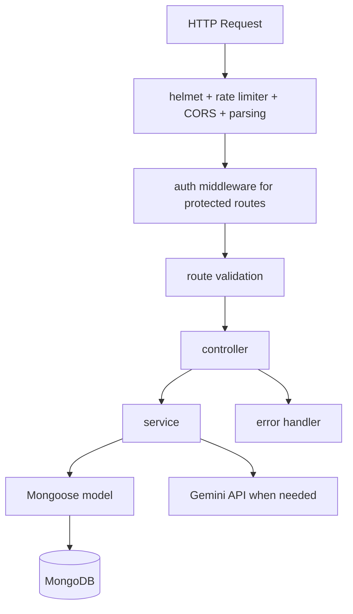
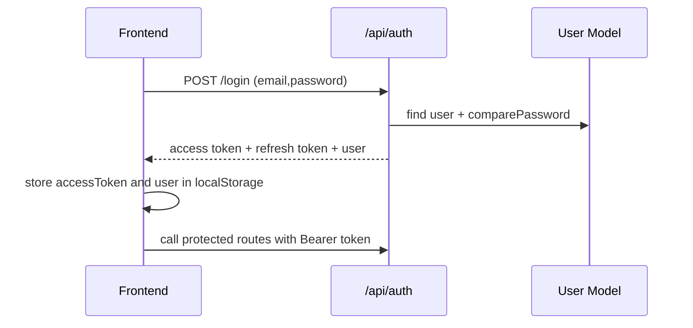

# Architecture and Request Flow

## Goal

Explain how the system works internally, from frontend interaction to persistence and AI-assisted analysis.

## Layered Backend Design

Backend follows route -> controller -> service -> model with middleware for cross-cutting concerns.

## Frontend Composition

- Static pages under frontend.
- Shared API abstraction in frontend/js/api-client.js.
- Page scripts implement UX and call API client.

Important behavior:
- API client auto-attaches Authorization header when token exists.
- On 401 from API, client clears session and redirects to login page.

## Authentication Flow

## Incident Analysis Flow (Core Business Path)

1. Controller validates asset ownership and description constraints.
2. Threat classification service uses Gemini-backed analysis.
3. Risk service computes score and level from likelihood and impact.
4. NIST mapping service returns controls/functions for threat type.
5. Recommendation service returns actionable mitigation steps.
6. Incident is persisted with full analysis snapshot.

Why this matters:
- Dashboards and reports consume one canonical incident record.
- Reprocessing is reduced because enrichment is stored at write-time.

## Data Ownership and Multi-User Isolation

Most domain reads/writes are filtered by req.user.userId.

Implications:
- Users can access only their own assets/incidents/risk views.
- Seeded accounts do not share records unless explicitly created per account.

## Error Handling Strategy

- Controllers handle expected validation/lookup failures with explicit 4xx responses.
- Unexpected failures are delegated to global error handler.
- Global handler normalizes Mongoose validation, duplicate key, and JWT errors.

## Rate Limiting Strategy

- API limiter on all routes: protects against burst abuse.
- Auth limiter on login/register/refresh: reduces brute-force risk.

## Extensibility Points

- Replace or augment AI provider in backend/config/ai-config.js.
- Add new threat mappings in threat knowledge base data source.
- Add organization-level tenancy by introducing organizationId field and middleware checks.
- Enforce permission-level authorization using user.permissions in JWT payload.
