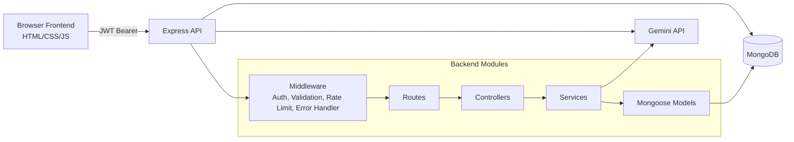

# System Overview

## Purpose

Hotel Cybersecurity Governance System is a web application for small and medium hotel teams to:

- Register and track digital assets.
- Report incidents in plain language.
- Classify threats and calculate risk automatically.
- Map incidents to NIST CSF functions and controls.
- Review trends and posture in dashboards.

## Product Scope

### In scope
- Authentication and profile management.
- Asset lifecycle (create, read, update, soft delete).
- Incident lifecycle (create, update, status, notes, search, soft delete).
- Threat analysis and knowledge base retrieval.
- Risk scoring, matrix, trends, and asset risk aggregation.
- Dashboard metrics and chart feeds.

### Out of scope (current implementation)
- Fine-grained RBAC enforcement by permission string.
- Multi-tenant organization model beyond per-user ownership.
- Automated alerting/notification pipelines.
- Password reset workflow implementation.

## High-Level Architecture

## Runtime Components

- Frontend: static pages under frontend with page-specific JavaScript modules.
- Backend: Node.js + Express server in backend/server.js.
- Database: MongoDB via Mongoose.
- AI provider: Gemini API through backend/config/ai-config.js.

## Request Lifecycle

1. Request reaches Express middleware stack (helmet, rate limiter, CORS, body parsing).
2. Protected routes validate JWT using auth middleware.
3. Route-level validators (express-validator) enforce contract shape.
4. Controller executes business logic, calling service layer where needed.
5. Mongoose persists or queries data.
6. Response is normalized into JSON with success and payload fields.
7. Global error handler converts known errors to HTTP responses.

## Security Model Summary

- JWT Bearer authentication for all non-auth routes.
- Request rate limiting:
  - Global API limiter: 500 requests per 15 minutes.
  - Auth limiter: 20 requests per 15 minutes.
- Helmet security headers.
- CORS allowlist with localhost defaults and optional CORS_ORIGIN extension.
- Password hashing through bcrypt.
- Soft deletes for Assets and Incidents.

## Deployment Model

- Frontend is static and can be served from GitHub Pages or any static host.
- Backend is a separate Node web service.
- Frontend chooses API base URL by hostname:
  - localhost or 127.0.0.1 -> http://localhost:5000/api
  - non-local host -> configured production API URL in frontend/js/api-client.js

## Navigation to Deeper Docs

- Setup and first run: ../tutorials/local-development.md
- First workflow execution: ../tutorials/report-first-incident.md
- Architectural details: ../guides/architecture-and-request-flow.md
- Full endpoint catalog: ../manuals/api-reference.md
- Schemas and config: ../manuals/data-model-reference.md
