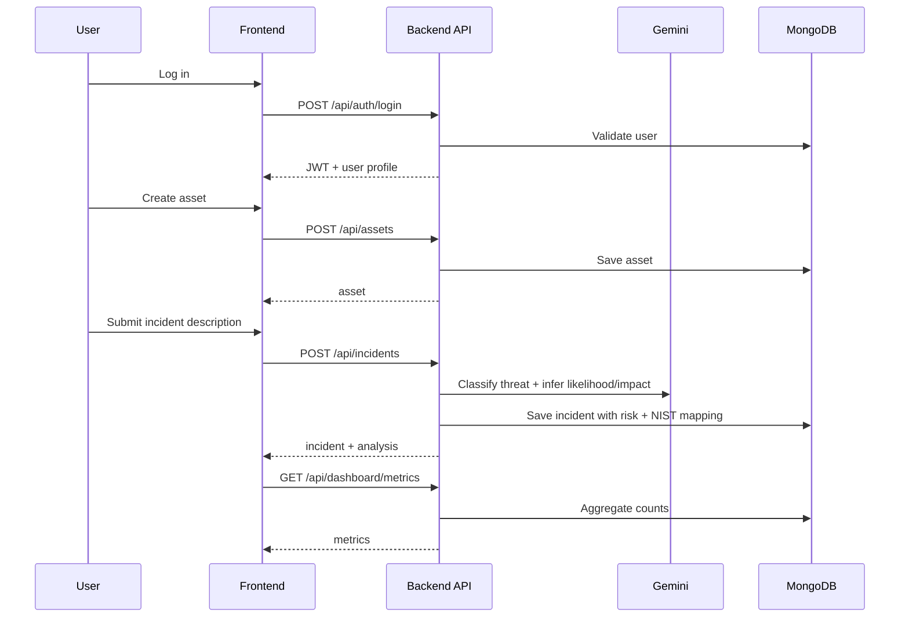

# Report Your First Incident End-to-End

## Goal

Complete one full operational workflow:

- authenticate,
- register an asset,
- submit an incident,
- inspect generated risk and recommendations,
- verify dashboard impact.

## Prerequisites

- Backend and frontend are running locally.
- You can log in with a valid user account.

If setup is not done yet, first complete: local-development.md.

## Workflow Diagram



## Step 1: Log in

1. Open login page.
2. Use seeded credentials or a newly registered account.
3. Confirm redirect to dashboard page.

Expected result:
- JWT token is stored in localStorage key accessToken.
- User data is stored in localStorage key user.

## Step 2: Create an asset

1. Open Assets page.
2. Choose Add New Asset.
3. Provide at least:
   - Asset Name
   - Asset Type
4. Submit.

Example payload sent by frontend:

```json
{
  "assetName": "Reception POS #1",
  "assetType": "POS",
  "location": "Front Desk",
  "description": "Primary billing terminal",
  "criticality": "High",
  "owner": "IT Supervisor",
  "status": "Active"
}
```

Expected result:
- Asset appears in asset table.

## Step 3: Submit incident report

1. Open Report Incident page.
2. Select the asset created in Step 2.
3. Enter a description with at least 20 characters.
4. Optionally set incident time and sensitive flags.
5. Submit and wait for analysis modal to finish.

Example payload:

```json
{
  "assetId": "<asset-id>",
  "description": "Front desk workstation showed suspicious remote login activity and unexpected process execution.",
  "incidentTime": "2026-04-02T12:20",
  "guestAffected": false,
  "sensitiveDataInvolved": true
}
```

Expected result:
- Incident is created with:
  - incidentId
  - threatType and threatCategory
  - likelihood and impact
  - riskScore and riskLevel
  - nistFunctions, nistControls, recommendations

## Step 4: Validate generated outputs

Open Incident Logs page and verify:

- status is Open by default,
- risk level is populated,
- recommendation list is present,
- note adding and status update actions are available.

## Step 5: Validate dashboard updates

Open Dashboard page and verify changes in:

- open incidents metric,
- risk distribution chart,
- recent incidents list.

## What to do if it fails

- 400 Validation failed:
  - confirm description length >= 20 and assetId is valid.

- 404 Asset not found:
  - ensure selected asset belongs to logged-in user.

- 401 Unauthorized:
  - token expired or missing; log in again.

- AI analysis failure:
  - verify Gemini env values and backend outbound internet.
