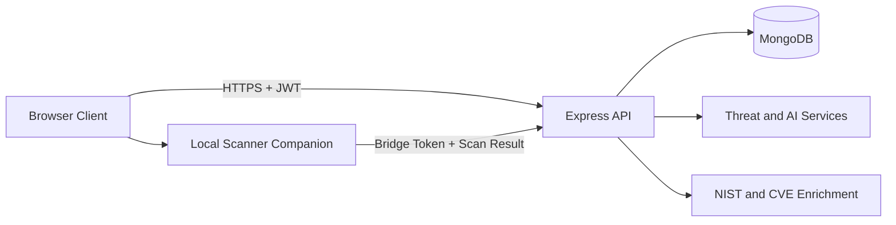
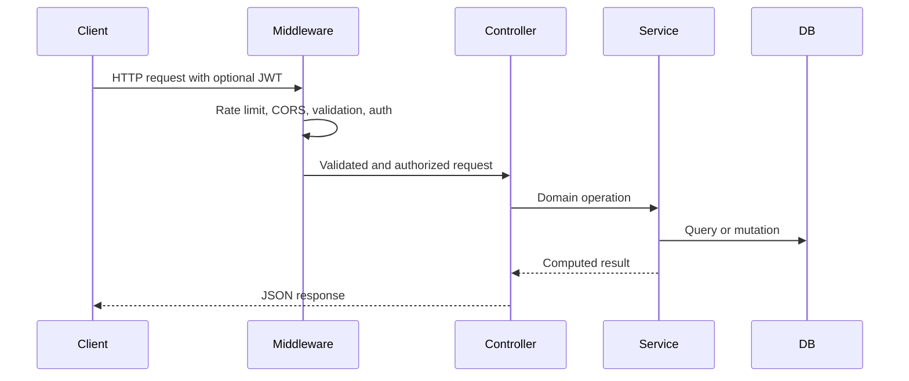

# Hotel Cybersecurity Governance System Technical Documentation

## Overview

This document is the single consolidated technical reference for the Hotel Cybersecurity Governance System. It is written as a standards-style engineering report and combines conceptual architecture context, implementation reference material, operational procedures, API contracts, and code-level examples from the current codebase. The intent is to support maintainers, developers, QA engineers, and operations staff with a reliable source of truth for technical behavior.

The system is implemented as a full-stack web platform with a static browser frontend and a Node.js/Express backend connected to MongoDB through Mongoose. Runtime capabilities include authentication and session control, asset lifecycle workflows, incident analysis, risk scoring, threat classification, governance-aligned mapping, local scan ingestion, dashboard analytics, and audit logging.

## Scope and Audience

The scope of this document includes backend service architecture, frontend runtime architecture, API route contracts, data model semantics, security controls, configuration references, operations procedures, and quality verification guidance. This document is intended for engineers who make code changes, reviewers who validate implementation quality, and operators responsible for service availability and secure deployment.

The scope excludes legal policy and organization-wide governance language. Those controls should be applied externally by governance stakeholders and mapped to the implementation details provided here.

## Background and Context

The system addresses a practical cybersecurity operations gap in hotel environments where incident reporting, asset visibility, and governance traceability are often fragmented across multiple tools. The implementation consolidates these activities into a unified workflow that can begin with user-reported incidents or asset scanning and continue through threat analysis, risk evaluation, and operational follow-up.

From a technical design standpoint, the project uses a layered backend boundary where middleware handles cross-cutting controls, controllers orchestrate route behavior, and services contain business logic. The frontend is intentionally modular and page-based to keep deployment simple while maintaining a reusable transport and session layer.

## System Architecture

The runtime architecture includes three primary planes: client interaction, API orchestration, and persistence/enrichment processing. Authentication and authorization gates are enforced before protected route execution, while enrichment and analysis services are invoked from incident and asset workflows.



Diagram placeholder: replace the Mermaid block above with the final rendered architecture diagram during publication.

## Request Lifecycle and Control Flow

The backend request lifecycle begins with secure middleware registration and route-level validation. For protected routes, the JWT is verified and the user state is loaded before permission checks are applied. Controller methods then call service-layer functions, which perform domain operations, enrichment calls, and persistence updates before returning normalized JSON responses.



Diagram placeholder: replace the Mermaid block above with the final rendered lifecycle sequence diagram during publication.

## Backend Implementation Reference

### Runtime and Middleware Composition

The backend entrypoint configures helmet, global API rate limiting, structured request logging, strict origin normalization for CORS, JSON parsing limits, and grouped route mounting. Health and root routes are available for service checks and top-level API verification.

```js
app.use('/api/auth', require('./routes/auth'));
app.use('/api/local-scanner', require('./routes/localScanner'));
app.use('/api/assets', authMiddleware, require('./routes/assets'));
app.use('/api/incidents', authMiddleware, require('./routes/incidents'));
app.use('/api/threats', authMiddleware, require('./routes/threats'));
app.use('/api/risk', authMiddleware, require('./routes/risk'));
app.use('/api/nist', authMiddleware, require('./routes/nist'));
app.use('/api/dashboard', authMiddleware, require('./routes/dashboard'));
app.use('/api/audit-logs', authMiddleware, require('./routes/auditLogs'));
```

### Security Middleware and Session Integrity

Authentication middleware validates bearer tokens, loads active user state, enforces password-change token invalidation, and rejects tokens with stale sessionVersion values. This ensures that sensitive account changes force reauthentication.

```js
const decoded = jwt.verify(token, process.env.JWT_SECRET);
const user = await User.findById(decoded.userId)
  .select('isActive passwordChangedAt permissions role sessionVersion');

if (tokenIssuedBeforePasswordChange(decoded, user)) {
  return res.status(401).json({
    success: false,
    message: 'Session expired after password change. Please log in again.',
  });
}
```

### Rate-Limiting Strategy

Rate limits are applied by traffic class. A broad API limiter controls general load, an authentication limiter controls credential attack surface, a password reset limiter reduces account abuse, and an enrichment limiter protects heavier analysis routes.

| Limiter | Window | Max Requests | Primary Purpose |
| :-- | :-- | :-- | :-- |
| apiLimiter | 15 minutes | 500 | General API load management |
| authLimiter | 15 minutes | 20 | Login and auth abuse control |
| passwordResetLimiter | 15 minutes | 5 | Password reset abuse control |
| enrichmentLimiter | 60 seconds | 30 | Protect enrichment and scan-heavy routes |

### Error Handling Boundary

The global error handler sanitizes potentially sensitive token and secret substrings before logging, maps known validation/database/auth errors to deterministic HTTP statuses, and prevents stack exposure in API responses.

```js
if (err.name === 'ValidationError') {
  return res.status(400).json({ success: false, message: 'Validation error', errors: messages });
}

if (err.code === 11000) {
  return res.status(400).json({ success: false, message: 'Duplicate field value' });
}

return res.status(500).json({ success: false, message: 'Internal server error' });
```

## API Contract Reference

### Authentication and Account Security Routes

The authentication surface supports registration, credential login, token refresh, password recovery, optional second-factor flows, and profile lifecycle updates.

| Method | Path | Auth Required | Notes |
| :-- | :-- | :-- | :-- |
| POST | /api/auth/register | No | Requires strong password and 3 unique security questions |
| POST | /api/auth/login | No | Returns session credentials and user profile context |
| POST | /api/auth/refresh | No | Exchanges refresh token for new credentials |
| POST | /api/auth/forgot-password | No | Starts password recovery process |
| POST | /api/auth/reset-password | No | Accepts security answers or TOTP/recovery path |
| POST | /api/auth/2fa/verify-login | No | Completes challenge-based login |
| POST | /api/auth/2fa/setup | Yes | Generates setup metadata for 2FA |
| POST | /api/auth/2fa/enable | Yes | Enables 2FA with a 6-digit code |
| POST | /api/auth/2fa/disable | Yes | Disables 2FA with verification |
| GET | /api/auth/profile | Yes | Fetches authenticated profile |
| PUT | /api/auth/profile | Yes | Updates profile fields |
| GET | /api/auth/security-questions | Yes | Reads configured security questions |
| PUT | /api/auth/security-questions | Yes | Updates question/answer set |
| POST | /api/auth/change-password | Yes | Rotates current password |

### Asset and Incident Domain Routes

Asset routes provide CRUD behavior, search, type enumeration, scan history retrieval, and security-context enrichment. Incident routes provide creation, retrieval, search, updates, status transitions, note insertion, and soft delete behavior.

| Method | Path | Permission |
| :-- | :-- | :-- |
| POST | /api/assets | asset:write |
| GET | /api/assets | asset:read |
| GET | /api/assets/asset-types | asset:read |
| GET | /api/assets/search | asset:read |
| GET | /api/assets/:id/security-context | asset:read |
| GET | /api/assets/:id/scan-history | asset:read |
| GET | /api/assets/:id | asset:read |
| PUT | /api/assets/:id | asset:write |
| DELETE | /api/assets/:id | asset:write |
| POST | /api/incidents | incident:write |
| GET | /api/incidents | incident:read |
| GET | /api/incidents/search | incident:read |
| GET | /api/incidents/:id | incident:read |
| PUT | /api/incidents/:id | incident:write |
| PUT | /api/incidents/:id/status | incident:write |
| POST | /api/incidents/:id/notes | incident:write |
| DELETE | /api/incidents/:id | incident:write |

### Analytical, Governance, and Reporting Routes

These routes expose threat analysis, risk calculations, NIST mappings, dashboard metrics, and audit views.

| Method | Path | Permission |
| :-- | :-- | :-- |
| POST | /api/threats/analyze | incident:write |
| POST | /api/threats/classify | incident:write |
| GET | /api/threats/types | incident:read |
| GET | /api/threats/details/:threatType | incident:read |
| POST | /api/risk/calculate | incident:write |
| GET | /api/risk/assessment/:incidentId | incident:read |
| GET | /api/risk/matrix | incident:read |
| GET | /api/risk/trends | incident:read |
| GET | /api/risk/by-asset | incident:read |
| GET | /api/risk/summary | incident:read |
| GET | /api/nist/functions | incident:read |
| GET | /api/nist/controls/:threatType | incident:read |
| GET | /api/nist/mapping/:incidentId | incident:read |
| GET | /api/nist/recommendations/:threatType | incident:read |
| GET | /api/nist/compliance-report | incident:read |
| GET | /api/dashboard/metrics | dashboard:read |
| GET | /api/dashboard/metrics/trends | dashboard:read |
| GET | /api/dashboard/charts/risk-distribution | dashboard:read |
| GET | /api/dashboard/charts/threat-categories | dashboard:read |
| GET | /api/dashboard/charts/vulnerable-assets | dashboard:read |
| GET | /api/dashboard/recent-incidents | dashboard:read |
| GET | /api/dashboard/overview | dashboard:read |
| GET | /api/audit-logs | Authenticated |
| GET | /api/audit-logs/summary | Authenticated |

### Local Scanner Bridge Routes

The local scanner bridge separates scan request authorization from scan result ingestion by issuing short-lived, one-time JWT bridge tokens.

| Method | Path | Auth Required | Notes |
| :-- | :-- | :-- | :-- |
| POST | /api/local-scanner/requests | Yes | Issues bridge token and upload metadata |
| POST | /api/local-scanner/results | No (tokenized) | Accepts one-time bridge token and scan payload |

```js
const payload = {
  sub: userId,
  jti,
  type: 'local-scan',
  asset: {
    assetId: sanitized.assetId,
    assetName: sanitized.assetName,
    assetType: sanitized.assetType,
    liveScan: sanitized.liveScan,
    vulnerabilityProfile: sanitized.vulnerabilityProfile,
  },
};
```

## Data Model Reference

The persistence layer contains seven primary entities: User, Asset, Incident, RiskAssessment, Threat, AuditLog, and ScanHistory. User and Asset include operational fields that influence security and lifecycle semantics.

### User Model Highlights

The User schema stores identity attributes, hashed credentials, permissions, role state, sessionVersion and refreshTokenVersion controls, security question sets, and 2FA state. The save hook hashes passwords and updates passwordChangedAt, and the toJSON transformation strips sensitive fields before serialization.

```js
UserSchema.pre('save', async function(next) {
  if (!this.isModified('password')) return next();
  const salt = await bcryptjs.genSalt(10);
  this.password = await bcryptjs.hash(this.password, salt);
  this.passwordChangedAt = new Date();
  next();
});
```

### Asset Model Highlights

Assets are user-scoped and support soft delete behavior through isDeleted/deletedAt. Query middleware automatically excludes soft-deleted records unless explicitly overridden. The schema also stores a liveScan object and a vulnerabilityProfile object used by enrichment and scanner workflows.

```js
AssetSchema.pre(/^find/, function(next) {
  if (!Object.prototype.hasOwnProperty.call(this.getFilter(), 'isDeleted')) {
    this.where({ isDeleted: false });
  }
  next();
});
```

## Threat and Risk Engine Reference

Threat classification combines AI analysis and threat-intelligence mapping, then enforces deterministic guardrails for high-risk ransomware indicators. Risk scoring computes score = likelihood x impact with bounded risk levels and recommendations.

```js
if (signal.isCriticalRansomware) {
  return {
    ...classification,
    threatType: 'Ransomware',
    confidence: Math.max(classification.confidence || 0, 85),
    likelihood: Math.max(classification.likelihood || 1, 4),
    impact: Math.max(classification.impact || 1, 4),
  };
}
```

```js
const riskScore = likelihood * impact;
if (riskScore >= 13) {
  return { level: 'Critical', severity: 'Immediate action required' };
}
```

## Frontend Runtime Reference

The frontend contains twelve HTML pages and eleven JavaScript modules. API communication and session control are centralized in api-client.js, while domain pages invoke module-specific methods for assets, incidents, dashboard metrics, risk views, audit logs, and user settings.

### Page Inventory

- index.html is the application landing page.
- login.html provides authentication and account-recovery entry points.
- dashboard.html provides operational risk and incident metrics.
- assets.html supports asset inventory, search, and enrichment views.
- report-incident.html captures incident submissions.
- incident-logs.html supports incident browsing and updates.
- risk-analysis.html presents risk prioritization views.
- audit-logs.html provides audit review output.
- settings.html contains profile and security settings.
- faq.html, user-guide.html, and contact-support.html support user assistance.

### Session and Token Handling

The client persists access and refresh tokens in session storage and migrates older local storage tokens for backward compatibility. Session validity combines inactivity and absolute duration checks, while 401 responses on authenticated requests trigger hard session expiry behavior.

```js
this.token = sessionStorage.getItem(ACCESS_TOKEN_STORAGE_KEY)
  || localStorage.getItem(ACCESS_TOKEN_STORAGE_KEY);

if (this.token && localStorage.getItem(ACCESS_TOKEN_STORAGE_KEY)) {
  localStorage.removeItem(ACCESS_TOKEN_STORAGE_KEY);
  sessionStorage.setItem(ACCESS_TOKEN_STORAGE_KEY, this.token);
}
```

## Configuration Reference

### Core Runtime Variables

| Variable | Purpose | Required |
| :-- | :-- | :-- |
| PORT | Backend listen port | Yes |
| HOST | Backend bind interface | Yes |
| NODE_ENV | Runtime mode | Yes |
| MONGODB_URI | Database connection string | Yes |
| JWT_SECRET | Access token signing secret | Yes |
| JWT_EXPIRATION | Access token TTL | Recommended |
| JWT_REFRESH_SECRET | Refresh token signing secret | Recommended |
| JWT_REFRESH_EXPIRATION | Refresh token TTL | Recommended |
| CORS_ORIGIN | Comma-separated trusted origins | Recommended |
| LOG_LEVEL | Logger verbosity | Optional |
| LOCAL_SCANNER_BRIDGE_SECRET | Bridge token signing secret | Required for local scanner |

Security note: credentials and secrets must be rotated periodically and managed through environment-level secret storage, not committed source files.

## Operational Procedures

### Local Development Procedure

1. Start the backend service with Node.js and confirm health at /health.
2. Serve the frontend as static files and open the app in a localhost browser context.
3. Register a test account through the API-backed login page.
4. Create an asset, then submit an incident linked to that asset.
5. Verify dashboard and risk endpoints reflect the new incident.

### Release Verification Procedure

1. Execute targeted backend tests for changed controllers and services.
2. Run syntax checks for touched backend and frontend JavaScript files.
3. Validate login, token refresh, and session expiry behavior.
4. Validate key domain workflows: asset CRUD, incident reporting, dashboard metrics.
5. If scanner-related logic changed, verify bridge token issuance and one-time result submission.

## Quality and Testing Reference

The repository includes route, controller, service, and model test files across authentication, incident, risk, NIST, scanner, and enrichment domains. The practical testing strategy is targeted execution of changed modules to reduce feedback cycle time while preserving behavioral confidence.

## Known Constraints and Engineering Considerations

Permission granularity is currently functional but role expansion may be required if future requirements introduce finer-grained authorization policies. High-volume analytical routes may require indexing and query plan tuning as production data grows. Soft-delete retention should be paired with an explicit archival policy to prevent unbounded storage growth.

## Maintenance Guidance

Any change that alters route behavior, security assumptions, data shape, or session logic should trigger a corresponding update in this document. This document is intended to remain a live technical baseline rather than a one-time project artifact.

## Appendix A: Backend Module Inventory

### Route Modules

auth.js, localScanner.js, assets.js, incidents.js, threats.js, risk.js, nist.js, dashboard.js, auditLogs.js.

### Controller Modules

authController.js, assetController.js, incidentController.js, threatController.js, riskController.js, nistController.js, dashboardController.js, localScannerController.js, auditLogController.js.

### Service Modules

aiService.js, assetSecurityContextService.js, auditLogService.js, cveEnrichmentService.js, localScannerBridgeService.js, nistCveService.js, nistMappingService.js, nistThreatIntelService.js, nmapScanService.js, recommendationService.js, riskCalculationService.js, scanHistoryService.js, shodanEnrichmentService.js, threatClassificationService.js, totpService.js.

### Model Modules

User.js, Asset.js, Incident.js, RiskAssessment.js, Threat.js, AuditLog.js, ScanHistory.js.

## Appendix B: Frontend Module Inventory

### Page Files

index.html, login.html, dashboard.html, assets.html, report-incident.html, incident-logs.html, risk-analysis.html, audit-logs.html, settings.html, faq.html, user-guide.html, contact-support.html.

### Script Files

api-client.js, auth.js, assets.js, dashboard.js, incident-report.js, incident-logs.js, risk-analysis.js, audit-logs.js, settings.js, help-pages.js, utils.js.

End of technical documentation.
